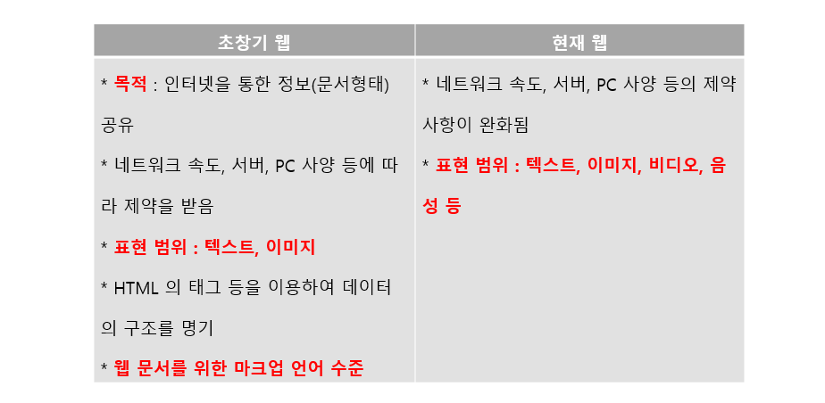
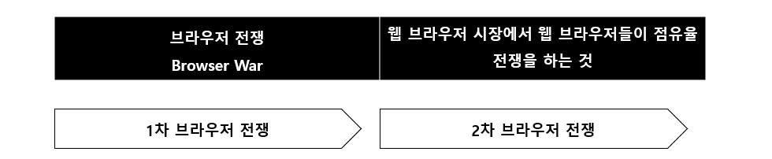
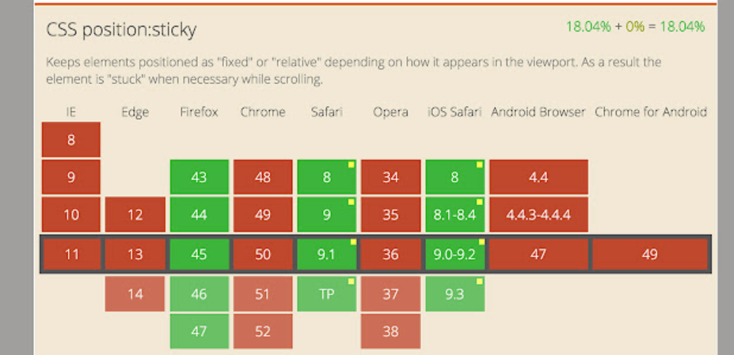
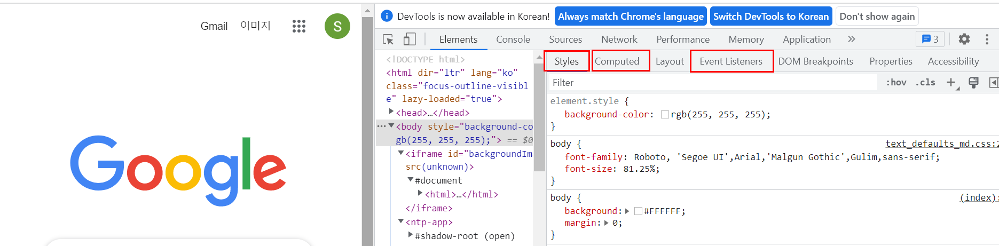
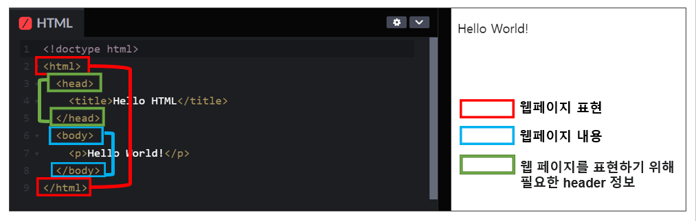
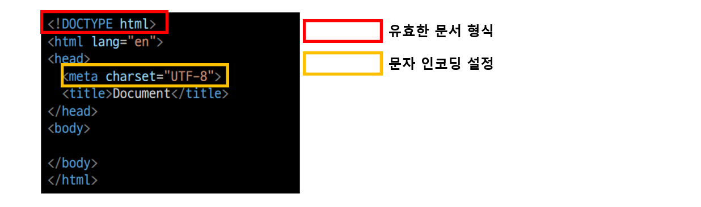
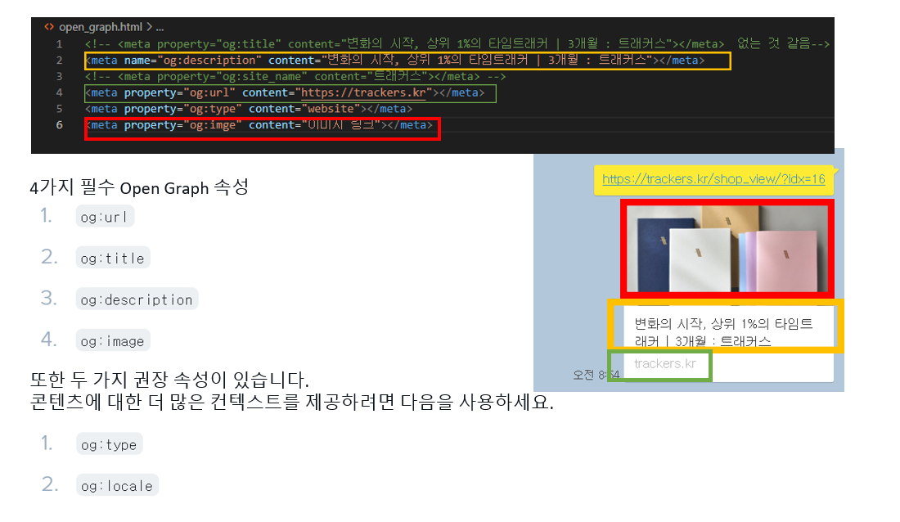
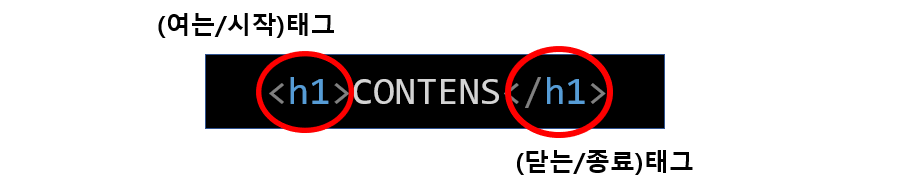
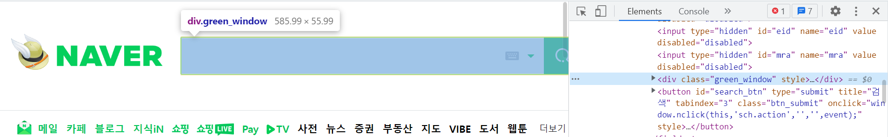
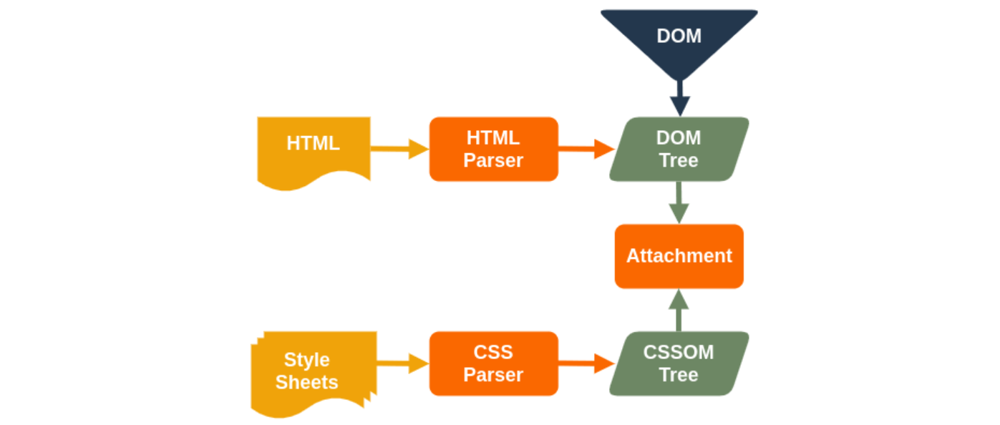

## 01. WEB

**🔻 손이 많이 움직여야 하는 과정 _ HTML/CSS/JS기초**

**🔻 많이 만들어보고, 많이 연습해 보는 것이 가장 중요** 

**🔻 실습의 비중을 더 늘릴 예정 _ 수요일 오후 실습 시간이 많아 질 예정** 

---

**🌱 개인 프로젝트 : 수요일 오후 실습 ~ 목요일 까지** **(목요일 오후 늦게 서로 리뷰)**

**🌱 팀 프로젝트 : 금요 프로젝트 _ 페어 프로그래밍 진행 (드라이버/네비게이터)**

---


### 💡 Happy WEB

* **웹 사이트의 구성 요쇼**

  

| **HTML** | **구조** |
| :------: | :------: |
| **CSS**  | **표현** |
|  **JS**  | **동작** |

---


* [**웹 사이트 구성요소 쉽게 이해하기**]([HTML CSS JavaScript - Free Online Editor and Tools (html-css-js.com)](https://html-css-js.com/))


---


#### ⏰ 웹의 역사 



* **HTML5의 가치** 

> **시장의 요구 Market Demand, 비용 절감의 효과, 네이티브 앱 개발 대비 생산성의 증대** 


#### ⚔ 브라우저 전쟁 



◼1990년대 후반 **Microsoft**사의Internet Explorer와 Netspace사의 Netscape Navigator의 사용자 확보 경쟁 Internet Explorer **의 완승**

**◼** **점유율을 높이기 위해** **W3C** **규정을 무시한 기능 구현 기술 확산** 

**-** **Active-X, Plug0in, Javascript** **등 동적 기술의 출현**

◼ **Internet Explorer의 보안 문제 발견** (RSS리더/탭 브라우저 기능의 취약성)

◼ Firefox 및 Chrome 등 **웹 표준을 기반으로 하는 브라우저 등장** 

(W3C가 권고하는 웹 표준에 부합하는 firefox가  Internet Explorer에 비해 우위)

◼ 전 세계적으로 IE 점유율이 지속적으로 낮아지고 있으며 chrome, firefox 등은 빠르속도로 늘고 있다. 

◼ 스마트 폰을 비롯한 MID기기의 등장으로 인한 **다양한 웹 브라우징 환경 확산**

---


#### ✔ W3C(World Wide Web Consortium) 에서 웹 표준이 확정되는 순서 


---

* **웹 사이트와 브라우저** 
  * 웹 사이트는 브라우저를 통해 동작함
  * 브라우저마다 동작이 약간씩 달라서 문제가 생기는 경우가 많음 (파편화)
  * 해결책으로 웹 표준이 등장


* **웹 표준**(WEB STANDARDS) 

* (사용자가 어떤 운영체제나 브라우저를 사용하더라도 동일한 결과물을 볼 수 있도록 하는 것을 말한다. )

  * **웹 표준의 탄생** 
    * "정보 취약자 및 소수자의 평등한 정보 접근성 요구 증대"
    * "특정 플랫폼 종속적인 인터넷 환경에 대한 개선 요구"
  * 웹에서 표준적으로 사용되는 기술이나 규칙 
  * 어떤 브라우저든 웹 페이지가 동일하게 보이도록 함 (크로스 브라우징)

  

  * 애플, 구글, 모질라, 마이크로 소프트가 앞장서서 표준을 만들어 나가고 있다. 
  * 브라우저 별 호환성 확인 할 수 있다 _ CAN I USE 
  * **[CAN I USE](https://caniuse.com/)**

  

---

####  **◼ 웹 표준의 장점** 

​	◾ 여러 브라우져를 통하여 같은 퀄리티의 기능이 사용 가능하다.

​	◾ 제공하는 정보를 모든 사람이 접근하여 보다 빠르고 즐겁게 웹 개발이 가능

​	◾ 사이트 업데이트 및 수정과 관리가 용이하다. 

​	◾ 검색 엔진 최적화 

​	◾ 웹을 이용하기 위해서 특별한 요구를 갖는 사람들이 보다 쉽게 웹을 이용할 수 있음

​	◾ 보편적인 웹 표준을 유지함으로써 기술 개발에 따른 상위호환성을 확보할 수 있음


#### (1) 웹 접근성이란?

> **웹에 접근하는 누구나 (신체적, 환경적 제한없이) 불편없이 웹을 사용할 수 있도록 하는 방식** 
>
> 장애인, 노인 등 정보 취약계층이 인터넷 상에서 차별없이 다르사용자와 동등하게 정보에 접근하고 이해할 수 있도록 보장하는 것으로 웹 접근성의 주 목적은 웹 컨텐츠를 이용하는 데에 어떠한 상황이나 환경에 구애받지 않고 접근할 수 있도록 하는 것이다. 


◼ 한국정보화진흥원 웹 접근성 연구소의 웹 접근성 정의 

> 어떠한 사용자, 어떠한 기술 환경에서도 사용자가 전문적인 능력 없이 웹 사이트에서 제공하는 모든 정보에 접근할 수 있도록 보장하는 것 


#### (2) 웹 접근성 준수 의무자 및 적용 시기 

웹접근성 준수 의무자 및 적용시기는 장애인차별금지법(장차법) 제21조 제1항 및 시행령 제14조에 규정되어 있습니다.

##### <연도별 웹 접근성 의무적용 대상기관 현황> (장차법 시행령 제14조 제2항, 별표3 관련, 보건복지부)

|    시행 년도     | 적용 범위                                                    |
| :--------------: | ------------------------------------------------------------ |
|  **2009.04.11**  | 공공기관(정부 및 지방자치단체), 국공립 사립 특수학교,특수반 설치 국공립유치원 및 학교, 장애아전담 보육시설, 종합병원, 사회복지시설, 장애인복지시설, 상시 근로자 300인이상 사업장(고용관계) |
|  **2010.04.11**  | 국공립 문화예술기관, 국공립(대학)박물관 및 미술관, 국립중앙도서관, 공공도서관, 박물관, 미술관 |
|  **2011.04.11**  | 국공립 유치원, 국공사립학교(초,중,고,대학교), 보육시설(100인 이상), 일반병원, 치과•한방 병원(입원 30인 이상), 상시 근로자 100~300인 사업장(고용관계) |
|  **2012.04.11**  | 민간 종합 공연장(1000석 이상), 사립대학 박물관               |
| ✔ **2013.04.11** | 병원(입원 30인 미만), 사립유치원, 평생교육시설, 연구기관, 직업훈련기관(1,000제곱미터 이상), 보육시설(100인 미만), 민간 일반 공연장, 소공연장, 상시 근로자 30~100인 사업장(고용관계), 모든 법인 |
|  **2015.04.11**  | 민간 일반 공연장 및 공연장, 영화관(300석 이상), 조각공원, 문화의 집, 복지회관, 사립미술관 및 박물관(500제곱이상) |

> **특히 2013년 4월 11일 부터 모든 법인은 웹 접근성을 준수해야 하기 떄문에, 홈페이지를 제작할 때 고려해야 한다.** 

> **웹 접근성 준수 의무있는 자가 의무를 지키지 않은 경우, 민사상 책임, 형사상 처벌, 행정상 진정 또는 과태료 책임을 부담할 수 있습니다.** 


#### (3) 웹 접근성 준수 시 기대 효과 

* 장애인, 고령자 등을 포함한 사용자층 확대
* 규정과 법적 요구 사항에 대한 준수 
* 다양한 환경, 새로운 기기에서의 이용
* 개발 및 운영의 효율성 제고 
* 사회 공헌 및 복지 기업으로서의 기업 이미지 향상


#### ✔ [W3C(World Wide Web Consortium) 접근성 지침(WCAG)](https://a11y.gitbook.io/wcag/international-standards)

> 웹 사이트/ 애플리케이션에서 충족해야 하는 기준을 정의하여 장애가 있는 사용자가 보다 쉽게 이용할 수 있도록 준수해야 하는 지침 
>
> 웹 서비스를 제작하는 사람들이 기획 / 디자인 / 개발 과정에서 고려애햐 할 요구사항 
>
> 접근성은 시각, 청각, 지체, 음성, 인지, 언어, 학습 및 신청 장애를 포함한 광범위한 장애를 포함합니다. 

`시각 (Visual)` `청각 (Auditory)` `지체 (Physical)` `음성 (Speech)` `인지 (Cognitive)` `언어 (Language)` `학습 (Learning)` `신경 (Neurological)`

WCAG는 각 지침을 **4가지 원칙의 범주**로 분류하여 제공합니다.

**인식**이 가능하고, **조작**이 가능하며, **이해**할 수 있고, **견고**해야한다. 

---

1️⃣ [**인식**]() `Perceivable` _ 모든 사용자는 서비스 콘텐츠를 인식할 수 있어야 합니다. 

**Q.** 시/청각 장애를 가진 사용자가 서비스를 인식하는데 문가 없습니까? 

> 정보 및 UI 컴포넌트가 인식 가능하도록 제공해야 합니다.
>
> * 대체텍스트 : 텍스트가 아닌 콘텐츠에 대한 적절한 대체 텍스트를 제공해야한다. 
> * 시간 기반 미디어 : 시간에 기반한 미다어의 데체 수단을 제공해야 한다. 
> * 적응성 : 정보나 구조를 잃지 않고 다양한 방식(예: 간단한 레이아웃)으로 표현할 수 있는 컨텐츠를 만든다. 
> * 명료성 : 사용자가 콘텐츠를 보고 들을 수 있도록 명확하게 구분할 수 있어야 한다. 


2️⃣ [**운용**]() `Operable` _ 모든 사용자는 서비스의 기능을 운용할 수 있어야 합니다.

**Q:** 마우스 없이 서비스를 이용할 수 있고, 성공적으로 수행할 수 있습니까?

> UI 컴포넌트와 내비게이션이 작동하는데 문제가 없어야 합니다.
>
> * 키보드 접근 : 키보드로 모든 기능을 사용할 수 있어야 합니다.
> * 충분한 시간 제공 : 콘텐츠를 읽고 사용할 수 있는 충분한 시간을 제공해야 합니다.
>   * 시간제한 조정, 시간제한연장, 실시간 예외, 필수 예외, 20시간 예외, 이동/깜박임/스크롤링, 자동 업데이트 
> * 발작 예방 : 발작이나 신체적 반응을 일으키는 것으로 알려진 방식으로 콘텐츠를 제작하지 말아야 합니다.
> * 탐색 가능 : 탐색하고, 콘텐츠를 찾고, 어디에 있는지 판단 할 수있는 방법을 제공해야 합니다.
> * 입력 양식 : 키보드가 아닌 다양한 입력을 통해 기능을 보다 수비게 조작 할 수 있도록 만들어야 한다. 


3️⃣ [**이해**]() `Understandable` : 모든 사용자가 서비스의 콘텐츠, 기능 사용법 등을 이해하기 쉬워야 합니다.

**Q:** 명확하고 이해하기 쉬운 콘텐츠를 제공하고 있습니까?

> 정보 전달 및 사용자 인터페이스(UI) 작동에 대해 이해하기 쉬워야 합니다.
>
> * 가독성 : 텍스트 내용을 읽고 이해하기 쉽게 작성해야 합니다.
> * 예측 가능성 : 예측 가능한 범주 내에서 작동할 수 있도록 만들어야 합니다.
> * 입력 도움 : 실수를 피하고 해결할 수 있도록 도움을 제공해야 합니다.


4️⃣ [**견고**]() `Robust` : 사용자가 이용하는 모든 기기 및 브라우저에서 접근, 사용 가능해야 합니다.

**Q:** 특정 운영체제 또는 브라우저에서만 서비스를 이용할 수 있지 않나요?

> 콘텐츠는 보조 기술을 포함하여 다양한 사용자 에이전트가 처리 할 수 있을 정도로 견고해야 합니다.
>
> * 호환성 : 보조 기술을 포함하여 현재, 미래의 도구와 호환성을 높여야 합니다.


---


### 💡 개발 환경 설정 

* **VS CODE** 

  * **open in browser**

  

  * **auto renmae tag**

  

  * **auto close tag**

  

  * **IntelliSense for CSS class names in HTML** 

  

  * **html css support**

  


* **Chrome 개발자 도구** 

  * 웹 브라우저 크롬에서 제공하는 개발과 관련된 다양한 기능을 제공 

  * 주요 기능

    

    * Elemets : DOM 탐색 및 CSS 확인 및 변경 
    * `Style`  : 요소에 적용된 CSS 확인
    * `Computed ` : 스타일이 계산된 최종 결과
    * `Event Listeners` : 해당 요소에 적용된 이벤트 JS

  * Sources, Network, Performance, Application, Security, Audits 등

---


### 💡 HTML (Hyper Text Markup Language)

> * Hyper Text : 참조(하이퍼링크)를 통해 사용자가 한 문서에서 다른 문서로 즉시 접근 할 수 있는 텍스트 
>
> * Markup Language : 태그 등을 이용하여 문서나 데이터의 구조를 명시하는 언

* HTML은 제목, 단락, 목록 등과 같은 본문을 위한 구조적 의미를 나타냄
* 링크, 인용과 그 밖의 항목으로 구조적 문서를만들 수 있는 방법을 제공
* 이미지와 객체를 내장하여 대화형 양식을 생성하는 데 사용가능
* HTML은 웹 페이지 콘텐츠 안의 꺾쇠<> 괄호에 둘러싸인 "태그"로 되어있는 HTML 요소 형태로 작성


---

#### ✔  Markup 

* **HTML 요소**(엘리먼트, Elements)와 그들의 속성(Attributes)과 문자 기반 **데이터 형태**와 **문자 참조**와 **엔티티 참조**를 포함하는 몇 가지 핵심 구성 요소로 이루어져 있다.
* **문서 형식 정의(DTD, Document Type Definition)**를 명시하는 문서 형식 선언(document type declaration)이다. 

*  HTML 5에서는 DTD를 지정하지 않아도 되고 오직 레이아웃 모드로 지정된다

* **HELLO WORLD**

```html
<!doctype html>
<html>
  <head>
    <title>Hello HTML</title>
  </head>
  <body>
    <p>Hello World!</p>
  </body>
</html>
```



* **Markup Example**

```html
<h1>HTML</h1>
<p>HTML이란 Hyper Text Markup Language 의 약자이다.</p>
<h2>Hyper Text.</h2>
<p>Hyper Text 란 기존의 선형적인 텍스트가 아닌 비 선형적으로 이루어진 텍스트를 의미하며, 이는 인터넷의 등장과 함께 대두되었다. 기본적
으로 Hyper Link를 통해 텍스트를 이동한다.</p>
<p>본문 : 이러한 Hyper Text 는 인간이 기억하는 방식까지 바꾸고 있는데 이를 컬럼비아대 벳시 스패로 교수팀은 구글 효과(Google Effect) 라
고 이름붙이고,해당 연구를 ‘사이언스’ 지에 게재하였다.</p>
<h2>구글 효과(Google Effect).</h2>
<p>구글 효과란...</p>
```


---


#### 💡 HTML 기본 구조 

---

◼ **[HTML 요소_Element 의 구조](https://developer.mozilla.org/ko/docs/Learn/HTML/Introduction_to_HTML/Getting_started)**

(1) **여는 태그(Opening tag)** : 요소가 시작(이 경우 단락의 시작 부분)부터 효과가 적용되기 시작

(2) **닫는 태그(Closing tag)** : 이름 앞에 슬래시(/)가 있는것을 제외하면 여는 태그(opening tag)와 같다. (단락의 끝 부분에 위치)

(3) **내용(Content)** : 요소의 내용이며, 이 경우 단순한 텍스트

(4) **요소(Element)** :  여는 태그, 닫는 태그, 내용을 통틀어 요소(element)라고함

---

* **html : 문서의 최상의 root 요소** 

* **head : 문서 메타데이터 요소** 

  > (데이터를 위한 데이터 ex) 사진 데이터를 나타내는 메타 데이터 
  >
  > [노출, 조리개, 장소, 크기, 셔터 스피드 등])

  > 사진이라는 데이터를 위한 데이터 = 메타데이터

  * 문서제목, 인코딩, 스타일, 외부 파일 로딩 등
  * 일반적으로 브라우저에 나타나지 않는 내용

* **body : 문서 본문 요소** 

  * 실제 화면 구성과 관련된 내용



---

#### 💡 head 예시 

```html
<title> : 브라우저 상단 타이틀
<meta> : 문서 레벨 메타데이터 요소 
<link> : 외부 리소스 연결 요소 (CSS 파일, favicon 등)
<script> : 스크립트 요소 (JS 파일/코드)
<style> : CSS 직접 작성
```


```html
<!DOCTYPE html>
<html>
    <head>
        <title>html 기초</title>
    </head>
    <body>
        html 기초
    </body>
</html>
```


---

#### 📑 HEAD 예시 _ Open Graph Protocol_(작성자의 카카오톡 대화를 통해 작성함)

* 메타 데이터를 표현하는 새로운 규약 
  * HTML 문서의 메타 데이터를 통해 문서의 정보를 전달
  * 메타정보에 해당하는 제목, 설명 등을 쓸 수 있도록 정의 



---


#### 📌 ELEMENT 요소 



* HTML 요소는 시작 태그와 종료 태그 그리고 태그 사이에 위치한 내용으로 구성 
  * 요소는 태그로 컨텐츠(내용)를 감싸는 것으로 그 정보의 성격과 의미를 정의 
  * 내용이 없는 태그들도 존재 (닫는 태그가 없음)
  * **br, hr, img, input, link, meta**

* 요소는 중첩(nested) 될 수 있음
  * 요소의 중첩을 통해 하나의 문서를 구조화 
  * 여는 태그와 듣는 태그의 쌍을 잘 확인해야함 
    * 오류를 변환하는 것이 아닌 그냥 레이아웃이 깨진 상태로 출력되기 때문에, 디버깅이 힘들어 질 수 있다. 

---

#### ◼ HTML with 개발자 도구 (Naver)



---


#### 📌 Atrribute 속성


* 태그별로 사용할 수 있는 속성은 다르다는 점 기억하기 
* **속성 지정 스타일 가이드 : 공백은 NO, "" 쌍따옴표 사용**


* 속성을 통해 태그의 부가적인 정보를 설정할 수 있음 
* 요소는 속성을 가질 수 있으며, 경로나 크기와 같은 추가적인 정보를 제공
* 요소의 시작 태그에 작성하며 보통 이름과 값이 하나의 쌍으로 존재
* 태그와 상관없이 사용 가능한 속성(HTML Global Attribute)들도 있음


* ##### HTML Global Attribute (ID, CLASS, STYLE 많이 사용할 예정 _ 기억해두기 )

  * 모든 HTML 요소가 공통으로 사용할 수 있는 대표적인 속성 (몇몇 요소에는 아무 효과가 없을 수 있음)
    * **id** : 문서 전체에서 유일한 고유 식별자 지정 
    * **class** : 공백으로 구분된 해당 요소의 클래스의 목록 (CSS, JS에서 요소를 선택하거나 접근)
    * **data-*** : 페이지에 개인 사용자 정의 데이터를 저장하기 위해 사용
    * **style** : inline 스타일 
    * **title** : 요소에 대한 추가 정보 지정 
    * **tabindex** : 요소의 탭 순서 


---


#### 💡 HTML 코드 예시 

```HTML
<!DOCTYPE html>
<html lang="en">
<head>
<meta charset="UTF-8">
<title>Document</title>
</head>
<body>
<!-- 이것은 주석입니다. -->
<h1>나의 첫번째 HTML</h1>
<p>이것은 본문입니다.</p>
<span>이것은 인라인요소</span>
<a href="https://www.naver.com">네이버로 이동!!</a>
</body>
</html>
```


#### ✔ 텍스트로 작성된 코드가 어떻게 웹 사이트가 되는 걸까? 


##### ◼ 렌더링 (Rendering) : 웹 사이트 코드를 사용자가 보게 되는 웹 사이트로 바꾸는 과정 


* **브라우저의 기본 구조** 


* **렌더링 엔진** 

  > 요청 받은 내용을 브라우저 화면에 표시해주는 역할 

  > 브라우저 마다 사용하는 렌더링 엔진이 각각 다르기 때문에, 모든 브라우저가 동일한 소스를 화면에 동일하게 그려주지 않고 엔진마다 읽을 수 있는 코드의 버전도 다르기 때문에 크로스 브라우징 이슈가 발생하곤 한다. 

* **렌더링 엔진 동작 과정**


#### ✔  DOM(Document Object Model)트리

* 텍스트 파일인 HTML 문서를 브라우저에서 렌더링 하기 위한 구조 
  * HTML 문서에 대한 모델을 구성함 
  * HTML 문서 내의 각 요소에 접근 / 수정에 필요한 프로퍼티와 메서드 제공함
* **DOM(Document Object Model), CSSOM(CSS Object Model) 생성 (Parsing)**



* 브라우저가 렌더링할 문서를 읽게 되는데, HTML과 CSS로 나눠서 읽게 된다. 

(이때, HTML, CSS 는 단순한 텍스트이므로 각각 연산과 관리가 가능하도록 HTML Parser와 CSS Parser를 사용해 관리가 가능한 Object Model로 만든다.)

* 모든 HTML, CSS파싱이 끝나기도 전에 이후의 과정을 수행하여 미리 사용자에게 보여줄 수 있는 내용들을 출력한다. 


#### ✔ 렌더 트리 구축 (Attachment)


* DOM 트리와 CSSOM 트리가 생성되면, 이 둘을 연결하여 표시해야 할 순서로 내용을 그려낼 수 있도록 하기 위해 렌더 트리를 생성한다. 
* 순수한 요소들의 구조와 텍스트만 존재하는 DOM 트리와는 달리 렌더 트리는 스타일 정보가 설정되어 있으며 실제 화면에 표현되는 노드들로만 구성된다.
* `display: none;`과 같은 속성이 설정된 노드는 화면에서 어떠한 공간도 차지하고 있지 않기 때문에 렌더 트리를 만드는 과정에서 제외된다.


#### ✔ 렌더 트리 배치 (Layout or Reflow)


* 렌더 트리가 생성되면 브라우저의 뷰포트 내에서 각 노드들의 정확한 위치와 크기를 계산한다.
*  `%`, `vh`, `vw`와 같이 상대적인 위치, 크기 속성은 모두 실제 화면에 그려지는 px단위로 변환되며 이 과정을 **Layout** 또는 **Reflow** 라고 한다.


#### ✔ 렌더 트리 그리기 (Paint)


* Layout과정이 완료되면 요소들의 위치와 크기, 스타일 계산이 완료된 렌더 트리를 사용해 브라우저는 요소들을 실제 화면에 그리게 된다. 
* 이 과정을 **Paint** 라고 한다.
* 처리해야 하는 스타일이 복잡할수록 Paint단계에 소요되는 시간이 길어지게 된다. 
* 간단한 예시로 단순한 단색 `background-color`, `color` 등의 경우 Painting 속도가 빠르지만 그라데이션이나 그림자 효과 등 복잡한 스타일은 Painting 소요시간이 비교적 더 오래 소요된다.

---


#### 📢 렌더링 최적화 

* 렌더링 과정을 모두 마친 후 최종적으로 브라우저에 페이지가 그려진다고 해서 렌더링 과정이 모두 끝난 것이 아니다. 
* 특정 액션이나 이벤트에 따라 HTML요소의 크기나 위치 등의 레이아웃 수치를 수정하면 그에 영향을 받는 자식 노드나 부모 노드들을 포함하여 Layout(Reflow)과정을 다시 수행하게 된다.
* 이렇게 되면 렌더 트리와 각 요소들의 크기와 위치를 다시 계산하게 되는데 이 과정을 **Reflow**
* Reflow된 렌더 트리를 다시 화면에 그려주는 과정을 **Repaint**라고 한다.


#### 📢 Reflow가 일어나는 대표적인 경우 

##### (이부분을 최소화 할 수록 렌더링이 최적화된다.)

- 페이지 초기 렌더링 시 (최초 Layout 과정)
- 브라우저 리사이징 시 (Viewport 크기 변경)
- 노드 추가 또는 제거
- 요소의 위치, 크기 변경
- 폰트 변경과 이미지 크기 변경


#### 📢  Repaint

* 무조건 Reflow가 발생해야 Repaint가 수행되는 것은 아니다. 
* `background-color`, `opacity`와 같이 레이아웃에는 영향을 주지 않는 스타일 속성이 변경되었을 때는 Reflow를 수행할 필요가 없기 때문에 Repaint만 수행하게 된다.


🛠 **Reflow가 일어나는 대표적인 속성**

```
👉 position, width, height, left, top, right, bottom, margin, padding, border, border-width,

clear, display, float, font-family, font-size, font-weight, line-height, min-height,
overflow, text-align, vertical-align, white-space...
```

🛠 **Repaint가 일어나는 대표적인 속성**

```
👉 background, background-image, background-position, background-repeat, background-size,

border-radius, border-style, box-shadow, color, line-style, outline, outline-color,
outline-style, outline-width, text-decoration, visibilty..
```


#### 📢 영향을 주는 노드 최소화하기 

> JavaScript와 CSS를 조합해 애니메이션이나 레이아웃 변화가 많은 요소의 경우 `position`을 `absolute` 또는 `fixed`를 사용하면 영향을 받는 주변 노드들을 줄일 수 있다.

> `fixed`와 같이 영향을 받는 노드가 전혀 없는 경우 Reflow과정이 전혀 필요없어지기 때문에 Repaint연산비용만 들게 되어 효율적이다.


#### 📢프레임 줄이기

> 단순하게 생각하면 0.1초마다 `1px`씩 이동하는 요소보다 0.3초마다 `3px`씩 이동하는 요소가 Reflow 연산비용이 3배가 줄어든다고 볼 수 있다. 따라서 부드러운 효과를 조금 줄이면서 성능 개선을 할 수 있다.

---

