## ✔ JavaScript

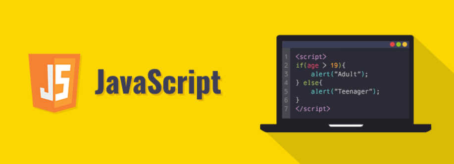

* 브라우저를 동적으로 만들기 위함 & 브라우저를 조작할 수 있는 유일한 언어 
  * browse란? 
    * URL로 웹WWW 을 탐색하며 서버와 통신하고, HTML 문서나 파일을 출력하는 GUI  기반의 소프트웨어 
    * 인터넷의 컨텐츠를 검색 및 열람하도록 함 
    * "웹 브라우저" 라고도 함 
    * 주요 브라우저 : Google Chrome, Mozilla Firefox, Microfoft Edge, Opera, Safari

---

#### ◼  JS의 탄생 

* 94년 다시 넷스케이프 커뮤니케이션스사의  Netscape Navigator(NN) 브라우저가 전 세계 점유율을 80% 이상 독점하며 브라우저의 표준 역할을 함 
* 당시 넷스케이프에 재직 중이던 브랜던 아이크가 HTML을 동적으로 동작하기 위한 회사 내부 프로젝트를 진행 중  JS를 개발 
* JS이름 변천사 : Mocha -> LiveScript -> JavaScript (1995)

* 그러나 1995년 경쟁사 마이크로소프트에서 이를 채택하여 커스터마이징한 JScript를 만듦
* 이를, IE 1.0 에 탑재 -> 1차 브라우저 전쟁의 시작

---

#### ◼ History of JavaScript

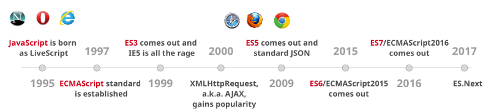

* **1차 브라우저 전쟁** 
  * 넷스케이프 vs 마이크로소프트 (이하 MS)
  * 빌 게이츠 주도하에 MS는 1997년 IE 4를 발표하면서 시장을 장악하기 시작
  * MS의 승리로 끝나며 2001년부터 IE의 점유율은 90%를 상회
  * 1998년 넷스케이프에서 나온 브랜던 아이크 외 후계자들은 모질라 재단을 설립
  * MS의 폭발적 성장, IE3에서 자체적인 JScript를 지원, 호환성 문제로 크로스 브라우징 등의 이슈 발생
  * 이후 넷스케이프 후계자들은 모질라 재단 기반의 파이어폭스를 개발
* **2차 브라우저 전쟁**
  * MS vs Google
  * 2008년 Google의 Chrome(이하 크롬) 브라우저 발표
  * 2011년 3년 만에 파이어폭스의 점유율을 돌파 후 2012년부터 전 세계 점유율 1위 등록
  * 크롬의 승리 요인 : 압도적인 속도, 강력한 개발자 도구 제공, 웹 표준 
* **파편화와 표준화 **
  * 제1차 브라우저 전쟁 이후 수맣은 브라우저에서 자체 JS 언어를 사용하게됨 
  * 서로 다른 JS가 만들어지면서 크로스 브라우징 이슈 발생으로 웹 표준의 필요성을 제기 
  * **Cross Browsing**
    * W3C에서 채택된 표준 웹 기술을 채용하여 각각의 브라우저마다 다르게 구현되는 기술을
      비슷하게 만들되, 어느 한쪽에 치우치지 않도록 웹 페이지를 제작하는 방법론 (동일성이 아닌 동등성)
    * 브라우저마다 렌더링에 사용하는 엔진이 다르기 때문
  * 96년부터 넷스케이프는 표준 제정의 필요성을 주장 
  * 97년 ECMAScript 1 (ES1) 탄생
  * 제1차 브라우저 전쟁 이후 제기된 언어의 파편화를 해결하기 위해 각 브라우저 회사와 재단은 표준화에 더욱 적극적으로 힘을 모으기 시작

---

#### ◼  JavaScript ES6+


* 2015년  ES2015 (ES6) 탄생 
  * “Next-gen of JS”
  * JS의 고질적인 문제들을 해결
  * JS의 다음 시대라고 불릴 정도로 많은 혁신과 변화를 맞이한 버전
  * 버전 순서가 아닌 출시 연도를 붙이는 것이 공식 명칭이나 통상적으로 ES6라 부름
  * 현재는 표준 대부분이 ES6+로 넘어옴

---

#### ◼  Vanilla JavaScript

* 크로스 브라우징, 간편한 활용 등을 위해 많은 라이브러리 등장 (jQuery 등)
* ES6이후, 다양한 도구의 등장으로 순수 JS 활용의 증대

```
Vanilla????

바닐라는 향신료 중 하나로, 난초의 일종인 바닐라속에 속해 있으며, 원산지는 멕시코이다. 
바닐라라는 이름은 스페인어 "Vainilla"에서 나왔으며 작은 꼬투리, 콩을 뜻한다.
```

```
뜻에서 유추할 수 있듯, 바닐라는 콩이라는 뜻으로 "핵심, 근본이 되는" 이라는 의미를 비유적으로 표현할 수 있다.
그러므로 바닐라 자바스크립트는 핵심이 되는 아무것도 포함되지 않은 순수 자바스크립트를 함축적으로 표현하는 것이다.
```


---


## ✔ DOM 

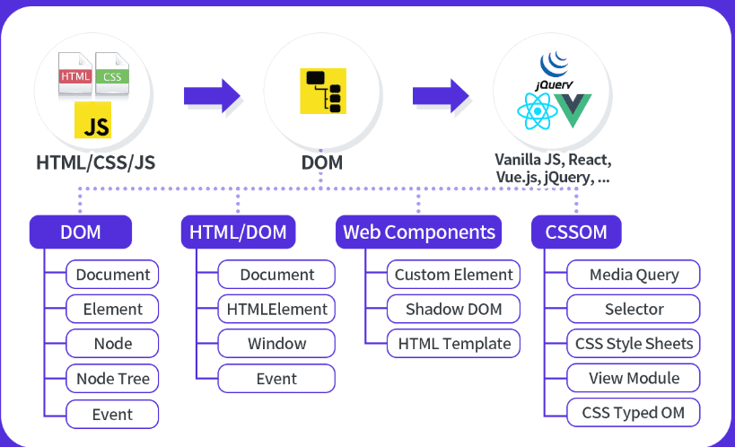

* 트리 구조 _ 자바스크립트를 통해 직접 구현 가능
* HTML, XML과 같은 문서를 다루기 위한 문서 프로그래밍 인터페이스
* 문서를 구조화하고 구조화된 구성 요소를 하나의 객체로 취급하여 다루는 논리적 트리 모델
* 문서가 구조화되어 있으며 각 요소는 객체(object)로 취급
* 단순한 속성 접근, 메서드 활용뿐만 아니라 프로그래밍 언어적 특성을 활용한 조작 가능
* **주요 객체**
  * window : DOM을 표현하는 창. 가장 최상위 객체 (작성 시 생략 가능)
  * document : 페이지 컨텐츠의 Entry Point 역할을 하며, <body> 등과 같은 수많은 다른 요소들을 포함
  * navigator, location, history, screen


#### DOM 해석 

* 파싱 Parsing 
  * 구문 분석, 해석 
  * 브라우저가 문자열을 해석하여 DOM Tree로 만드는 과정 

#### BOM 

* Browser Object Model
* 자바스크립트가 브라우저와 소통하기 위한 모델
* 브라우저의 창이나 프레임을 추상화해서 프로그래밍적으로 제어할 수 있도록 제공하는 수단
  * 버튼, URL 입력창, 타이틀 바 등 브라우저 윈도우 및 웹 페이지 일부분을 제어 가능
* window 객체는 모든 브라우저로부터 지원받으며 브라우저의 창(window)를 지칭


#### BOM 조작 

```
window.open()

window.print()

widow.confirm()

window.document
```


#### JS CORE

```
const numbers = [1, 2, 3, 4, 5]
```

* 브라우저와 그 내부의 문서를 조작하기 위해 ECMAScript를 학습


---


## ✔ DOM 조작 


#### 01. alert('js 학습이 시작되었습니다')

```html
console.log('hello.js!')
alert('js 학습이 시작되었습니다.')
```

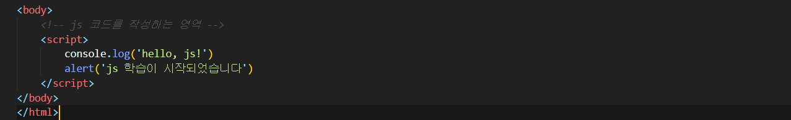


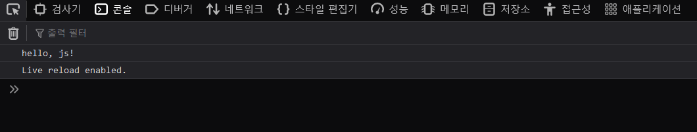


* #### **window.print()**

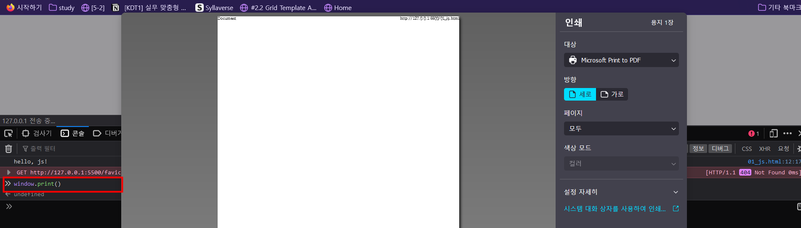


* #### window.confirm('가입하시겠습니까?')

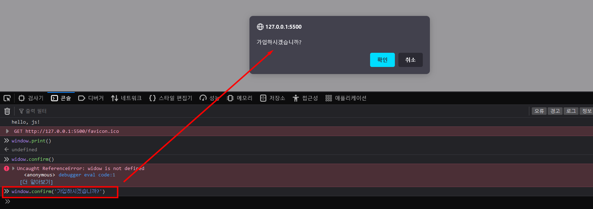


---


#### 02. js.html

```html
body>
    <!-- js 코드를 작성하는 영역 -->
    <script>
        console.log('hello, js!')
        // h1요소 (element)를 만들고 
        const title = document.createElement('h1')
        // 텍스트를 추가하고 
        title.innerText = 'JS 기초'
        // 선택자로 body 태그를 가져와서 
        const body = document.querySelector('body')
        // body 태그에 자식 요소로 추가 
        body.appendChild(title)
        
    </script>
</body>
```

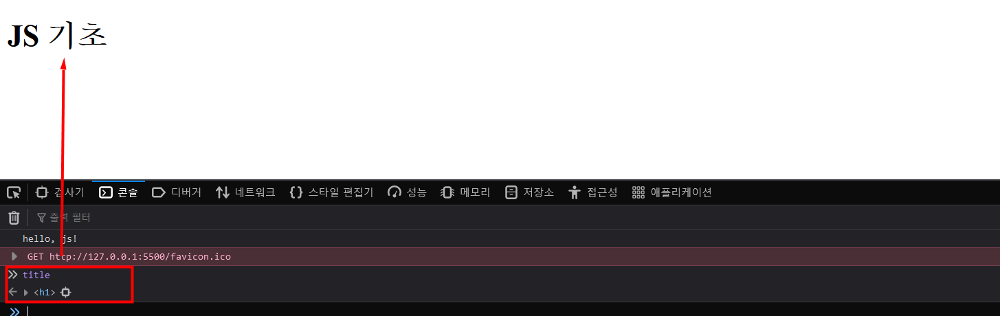

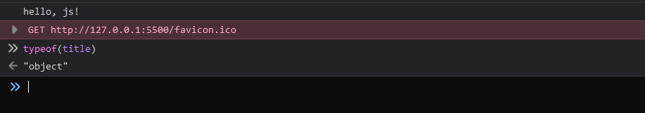


---


* **js에서는 변수를 선언할 때 키워드가 필요하다.** 

* **var, const, let**

#### 👉[var, let, const 차이점 5가지](https://velog.io/@goyou123/%EC%9E%90%EB%B0%94%EC%8A%A4%ED%81%AC%EB%A6%BD%ED%8A%B8-%EB%B3%80%EC%88%98-%EC%84%A0%EC%96%B8-%EB%B0%A9%EC%8B%9D%EC%9D%98-%EC%B0%A8%EC%9D%B4%EC%A0%90-var-let-const)


---


#### 02. select.html

```html
<body>
    <!-- 선택해서 조작할것 = 선택자가 너무나도 중요하다. -->
    <h1 class="title">JS 기초</h1>
    <h2>DOM 조작</h2>
    <p class="text">querySelector</p>
    <p class="text">querySelectorAll</p>

    <script>
        // 선택자를 활용해 선택할때 
        // 하나를 선택한다. querySelector
        // 모든 결과를 선택한다. uerySelectorAll
        console.log(document.querySelector('#title'))
        console.log(document.querySelectorAll('.text'))
        // NodeList(2)[P.text, p.text]
        console.log(document.querySelector('.text'))
        // <p class=text>querySelector</p>
    </script>
</body>
```


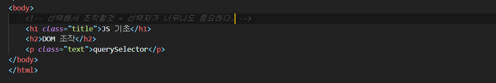

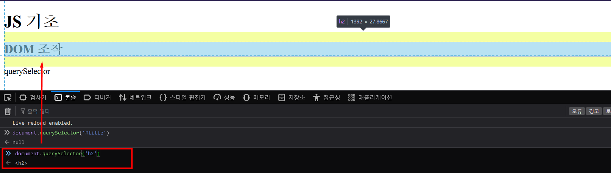


#### ⭐ all 차이점 알아두기 정말 중요 


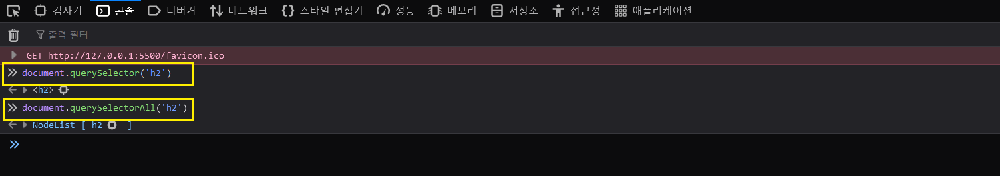


---


* **a 태그 **

  ```
  a.innerText = '구글로 떠나기'
  ```

  

* **body에 a 태그 추가** 

```
const body = document.querySelector('body')
body.appendChild(a)
```


---

* **title.innerHtml 잘 사용하지 말것** 

* **사이트간 스크립팅**

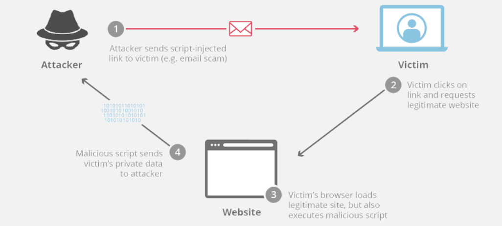

---

* **삭제** 

```
body.removeChild(a)

title.remove()
```

---


#### 03. attribute.html

```html
<body>
    <h1 class="red">안녕하세요.</h1>
    <script>
        // a tag 조작
        const a = document.createElement('a')
        a.innerText = '실라버스'
        const body = document.querySelector('body')
        body.appendChild(a)
        a.setAttribute('href', 'https://syllaverse.com')
        console.log(a.getAttribute('href'))

        // h1 tag 조작
        const h1 = document.querySelector('h1')
        h1.getAttribute('class')
        h1.setAttribute('class', 'blue')
        console.log(h1.classList)
    </script>
</body>
```

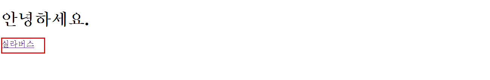

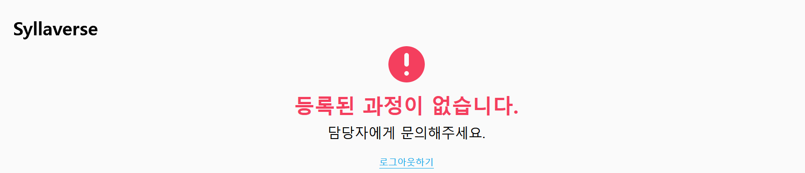


---


#### 04. event.html

```html
<body>
    <h1>복습 말고 느낌만</h1>
    <button id="btn1">클릭</button>

    <script>
        // btn1
        const btn1 = document.querySelector('#btn1')
        // btn1이 클릭되면 함수 실행
        btn1.addEventListener('click', function() {
            // h1 태그를 잡아서 
            const h1 = document.querySelector('h1')
            // 클래스 blue를 토글하자.
            h1.classList.toggle('blue')
        })

        // input
        const input = document.querySelector('input')
        input.addEventListener('input', function(e) {
            console.log(e.target.value)
        })
    </script>
</body>
```


---


#### ◼ [주요 메서드 ( Text node, Element node 생성)](https://sharryhong.github.io/2016/12/28/javascript-dom/)

* `document.createElement('element')` 요소 만들기. 실제 DOM에 붙는건 아님
* `document.createTextNode('text')` 텍스트 노드 만들기
* `document.createAttribute("name");` 잘쓰지않음
* `document.getElementById("idname");` id로 대상(요소노드)을 선택
* `document.getElementsByTagName("p");` 요소명으로 선택
* `document.getElementsByClassName('classname');` 클래스명으로 선택
* `document.querySelector(css selector);`막강!!! IE8이상. 첫번째 하나만 반환
* `document.querySelectorAll(css selector);` 상동. 전체 복수로 반환createEvent()
* `target.addEventListener(type, listener[, options]);`dispatchEvent() removeListener()


#### ◼ [주요 메서드 (속성을 다루는 기능, 이벤트)](https://sharryhong.github.io/2016/12/28/javascript-dom/)

* `element.hasAttribute(attName);` true/false 반환
* `element.getAttribute(attributeName);`
* `element.removeAttribute(attrName);`
* `element.removeAttribute(attrName);`

* `element.setAttribute(name, value);`
* `target.addEventListener(type, listener[, options]);`