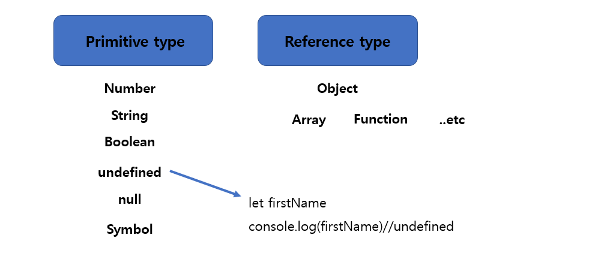
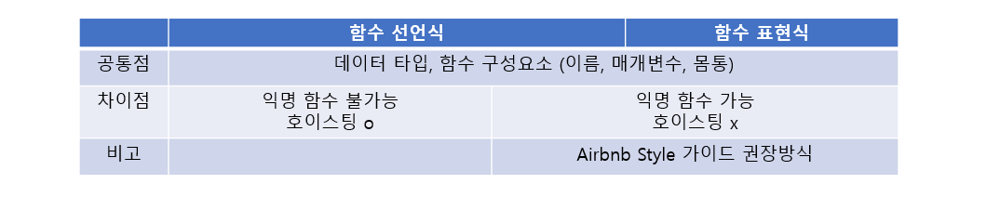

### ✔ ECMA Script

#### [코딩 스타일 가이드] 

* **코딩 스타일의 핵심은 합의된 원칙과 일관성**
* **코딩 스타일은 코드의 품질에 직결되는 중요한 요소**


#### 💡 변수와 식별자 

```js
let foo //선언
console.log(foo) //undefined
```

* **선언 Declaration** : **변수를 생성하는 행위 또는 시점**

```js
foo = 11 //할당
console.log(foo) //11
```

* **할당 Assignment : 선언된 변수에 값을 저장하는 행위 또는 시점**

```js
let bar = 0 //선언+할당
console.log(bar) //0
```


#### 💡 호이스팅 _ hoisting

**“Before run all the code, the browser first get all declarations , hoisting is the name of this process.”** 

(호이스팅이란 코드가 실행되기 전에 브라우저가 모든 변수들의 선언을 먼저 하는 과정)

* **변수를 선언 이전에 참조할 수 있는 현상**
* **변수 선언 이전의 위치에서 접근 시  undefined를 반환**
* **JS는 모든 선언을 호이스팅을 함**
* **var, let, const 모두 호이스팅이 발생하지만, var는 선언과 초기화기 동시에 발생하여 일시적 사각지대가 존재하지 않는다.**

* let과 const 는 모두 호스팅이 가능하나 TDZ 영향받음
  * TDZ (Temporal Dead Zone) : TDZ 시맨틱은 선언 전에 변수에 접근하는 것을 금지 
  * 코드 실행 중 변수가 선언되는 지점에 TDZ에서 벗어나게 되어 접근이 가능해짐

---

| **키워드** | **재선언** | **재할당** | **스코프** |
| :--------: | :--------: | :--------: | :--------: |
|    let     |     X      |     O      |    블록    |
|   const    |     X      |     X      |    블록    |
|    var     |     O      |     O      |    함수    |

---


### ✔ 데이터 타입



---


### ✔ 연산자


---


### ✔ 조건문

* **if** : **조건 표현식의 결과값을 Boolean 타입으로 변환 후 참/거짓을 판단**

* **switch** : **조건 표현식의 결과값이 어느 값 case에 해당하는지 판별** **(조건문이 많을 경우 사용)**

* **if, else if, else**

  * 조건은 소괄호 condition안에 작성
  * 실행할 코드는 중괄호 {} 안에 작성 
  * 블록 스코프 생성

  ```js
  if (condition) {
  	//do nothing
  }else if (condition) {
  	//do nothing
  }else{
  	//do nothing
  }
  ```

  

---


### ✔ 반복문 


* **while**
  * 조건문이 참인 동안 반복 시행, 블록 스코프 생성 
  * 조건은 소괄호 안에 작성 
  * 실행할 코드는 중괄호 안에 작성
* **for**
  * 세미콜론으로 구분되는 세 부분으로 구성, 블록 스코프 생성
  * for (initialization; condition; expression) 
    * initialization : 최초 반복문 진입 시 1회만 실행되는 부분 
    * condition : 매 반복 시행 전 평가되는 부분 
    * expression : 매 반복 시행 이후 평가되는 부분 
* **for in**
  * 객체의 속성들을 순회할 때 사용, 블록 스코프 생성
  * 배열도 순회 가능하지만 권장하지 않음 
  * 실행할 코드는 중괄호 안에 작성 
* **for of**
  * 반복가능한 객체를 순회하며 값을 꺼낼 때 사용, 블록 스코프 생성
  * 실행할 코드는 중괄호 안에 작성 

---


### ✔ 함수 

#### JavaScript에서 함수를 정의하는 방법은 주로 2가지로 구분

1. **함수 선언식 (function declaration)** 
2. **함수 표현식 (function expression)**


◼ **함수의 정의**

```js
function name(args) {
	return num1 + num2
}
```

* name 함수의 이름 
* args 매개변수 
* 함수 body (중괄호 내부)


◼ **함수 표현식 (function expression)**

* 함수를 표현식 내에서 정의하는 방식

* 함수의 이름을 생략하고 익명 함수로 정의 가능

---

**⭐ 인자 작성 시 ‘=’ 문자 뒤 기본 인자 선언 가능**

**⭐ 매개변수와 인자의 개수 불일치 허용**

**⭐ Rest Parameter : 함수가 정해지지 않은 수의 매개변수를 배열로 받음**

**⭐ Spread operator : 배열 인지를 전개하여 전달 가능** 




---


### ✔ Arrow Function

```js
const arrow1 = function (name) {
return `hello, ${name}`
}
// 1. function 키워드 삭제
const arrow2 = (name) => { return `hello, ${name}` }
// 2. 매개변수가 1개일 경우에만 ( ) 생략 가능
const arrow3 = name => { return `hello, ${name}` }
// 3. 함수 바디가 return을 포함한 표현식 1개일 경우에 { } & return 삭제
가능
const arrow4 = name => `hello, ${name}`
```

* **string.includes(value)** : 문자열에 value 가 존재하는지 판별 후 참 또는 거짓 반환
* **string.split(value)** : value가 없을 경우, 기존 문자열을 배열에 담아 반환
  * : value가 빈 문자열일 경우 각 문자로 나눈 배열을 반환
  * : value가 기타 문자열일 경우, 해당 문자열로 나눈 배열을 반환
* **string.replace(from, to)** : 문자열에 from 값이 존재할 경우, 1개만 to 값으로 교체하여 반환
* **string.replaceAll(from, to)** : 문자열에 from 값이 존재할 경우, 모두 to값으로 교체하여 반환
* **string.trim()** : 문자열 시작과 끝의 모든 공백문자를 제거한 문자열 반환
* **string.trimStart()** : 문자열 시작의 공백문자를 제거한 문자열 반환
* **string.trimEnd()** : 문자열 끝의 공백문자를 제거한 문자열 반환 


---


### ✔ Array

* **reverse** : 원본 배열의 요소들의 순서를 반대로 정렬
* **push & pop**  : 배열의 가장 뒤에 요소를 추가 또는 제거
* **unshift & shift** : 배열의 가장 앞에 요소를 추가 또는 제거
* **includes** : 배열에 특정 값이 존재하는지 판별 후 참/거짓 반환
* **indexOf** : 배열에 특정 값이 존재하는지 판별 후 인덱스 반환, 요소가 없을 경우 -1 반환
* **join** : 배열의 모든 요소를 구분자를 이용하여 연결 구분자 생략 시 쉼표 기준

* **forEach** : 배열의 각 요소에 대해 콜백 함수를 한 번씩 실행, 반환 값 없음
* **map** : 콜백 함수의 반환 값을 요소로 하는 새로운 배열 반환
* **filter** : 콜백 함수의 반환 값이 참인 요소들만 모아서 새로운 배열을 반환
* **reduce** : 콜백 함수의 반환 값들을 하나의 값(acc)에 누적 후 반환
* **find** : 콜백 함수의 반환 값이 참이면 해당 요소를 반환
* **some** : 배열의 요소 중 하나라도 판별 함수를 통과하면 참을 반환
* **every** : 배열의 모든 요소가 판별 함수를 통과하면 참을 반환


---


### ✔ Object

* 객체는 속성(property)의 집합이며, 중괄호 내부에 key와 value의 쌍으로 표현
* key 는 문자열 타입만 가능 
* value는 함수를 포함하여 모든 타임 가능
* 객체 요소 접근은 점 또는 대괄호로 가능 


