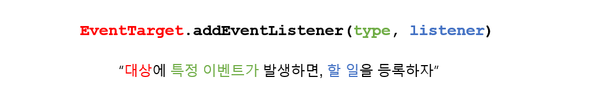
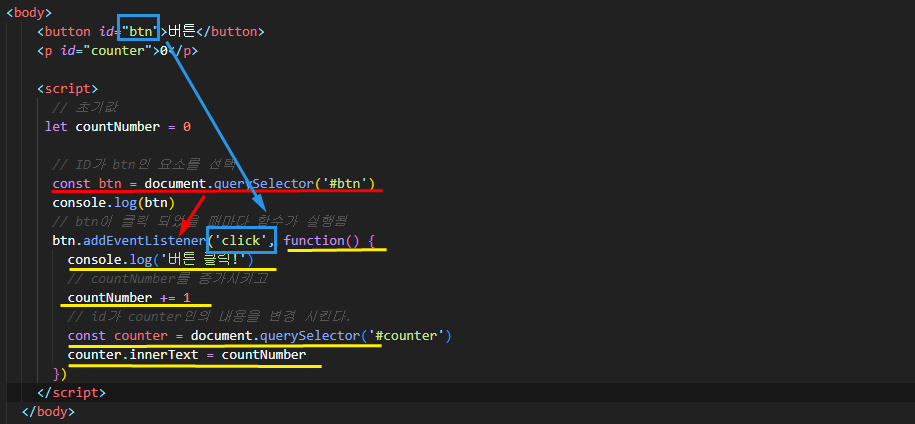
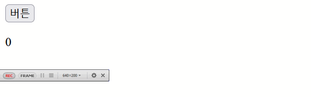
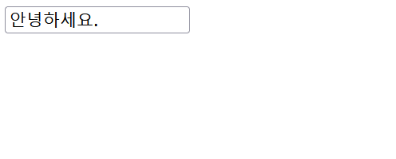
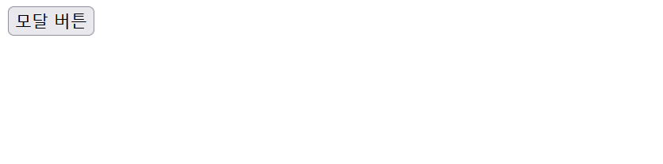
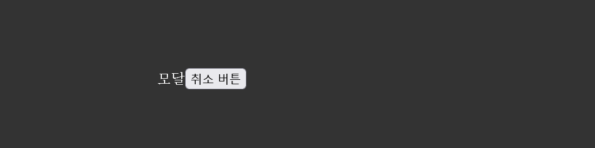
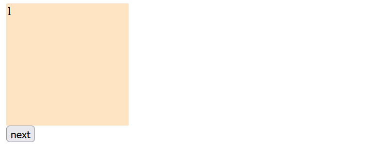
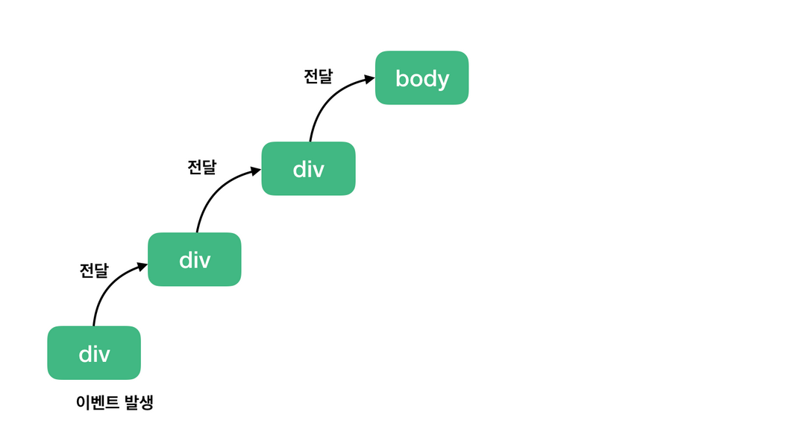
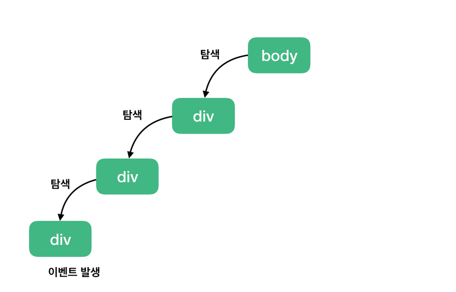

### ✔ EVENT  _ ⭐  ~하면 ~ 한다. 

* **네트워크 활동이나 사용자와의 상호작용 같은 사건의 발생을 알리기 위한 객체**
* **이벤트 발생**
  * 마우스를 클릭하거나 키보드를 누르는 등 사용자 행동으로 발생할 수도 있다. 
  * 특정 메서드를 호출하여 프로그래밍적으로도 만들어 낼 수 있다. 



---

* **button.html**



```html
<body>
    <button id="btn">버튼</button>
    <p id="counter">0</p>
    
    <script>
      // 초기값
     let countNumber = 0
  
      // ID가 btn인 요소를 선택
      const btn = document.querySelector('#btn')
      console.log(btn)
      // btn이 클릭 되었을 때마다 함수가 실행됨
      btn.addEventListener('click', function() {
        console.log('버튼 클릭!')
        // countNumber를 증가시키고
        countNumber += 1
        // id가 counter인의 내용을 변경 시킨다. 
        const counter = document.querySelector('#counter')
        counter.innerText = countNumber
      })
    </script>
  </body>
```




---


* **input.html**

```html
<body>
    <input type="text" id="text-input">
    <script>
        // 1. input 가져오기
        const textInput = document.querySelector('#text-input')
        // 2. input 이벤트 등록
        textInput.addEventListener('input', function(event) {
            // 뭔가 입력된 내용을 받아오고 싶다. 
            // input의 value를 받아오고 싶다. 
            // input은 이벤트의 대상!! 
            console.log(event)
            console.log(event.target.value)
        // 3. 그대로 출력
        
        })
    </script>
</body>
```



---


* **prevent.html**

```html
<body>
    <div>
      <h1>정말 <span>중요한</span> 내용</h1>
    </div>
    <p>Lorem ipsum dolor sit amet consectetur adipisicing elit. Iste cum et molestiae natus esse molestias nisi porro numquam amet mollitia ea adipisci, assumenda veritatis </p>
    <script>
      const h1 = document.querySelector('h1')
      h1.addEventListener('copy', function(event) {
        // event의 기본 동작을 막고,
        event.preventDefault()
        console.log('삐빅 복사를 할 수 없습니다.')
      })
      
      h1.addEventListener('click', function(event) {
        event.preventDefault()
        console.log(event.button)
      })
    </script>
  </body>
```


---


* **modal.html**

  ```html
  <body>
    <button id="modal-btn">모달 버튼</button>
    <div id="modal-content" class="modal-overlay">모달
      <button id="modal-cancel-btn">취소 버튼</button>
    </div>
  
    <script>
      // 모달 버튼이 클릭되면
      const modalToggle = function() {
        document.querySelector('#modal-content').classList.toggle('active')
      }
      
      const modalBtn = document.querySelector('#modal-btn')
      modalBtn.addEventListener('click', modalToggle)
  
      // 모달 취소 버튼이 클릭되면 
      const modalCancelBtn = document.querySelector('#modal-cancel-btn')
      modalCancelBtn.addEventListener('click', modalToggle)
  
      // 모달 오버레이를 클릭하면
      const modalOverlay = document.querySelector('#modal-content')
      modalOverlay.addEventListener('click', modalToggle)
  
    </script>
  </body>
  ```

  

  




---


* **carousel.html**

```html
<body>
  <div class="container">
    <div class="carousel-items">
      <div class="carousel-item active">1</div>
      <div class="carousel-item">2</div>
      <div class="carousel-item">3</div>
      <div class="carousel-item">4</div>
    </div>
  </div>
    <button id="nextBtn">next</button>
  <script>
    const nextBtn = document.querySelector('#nextBtn')
    nextBtn.addEventListener('click', function() {
      // 지금 active인 것은 어떻게 알죠?
      const currentElement = document.querySelector('.active')
      // 전체 item 중에....... 이 Element의 인덱스?
      const items = document.querySelectorAll('.carousel-item')
      const idx = [...items].indexOf(currentElement)
      console.log(currentElement, items, idx)
      currentElement.classList.toggle('active')
      items[(idx+1)%items.length].classList.toggle('active')
    })
  </script>
</body>
```




----


### ✔ EVENT Bubbling

> 이벤트 버블링은 특정 화면 요소에서 이벤트가 발생했을 때 해당 이벤트가 더 상위의 화면 요소들로 전달되어 가는 특성을 의미

> 하위의 클릭 이벤트가 상위로 전달되어 가는 그림




### ✔ EVENT Capture



> 이벤트 캡쳐는 이벤트 버블링과 반대 방향으로 진행되는 이벤트 전파 방식

> 클릭 이벤트가 발생한 지점을 찾아내려 가는 그림


