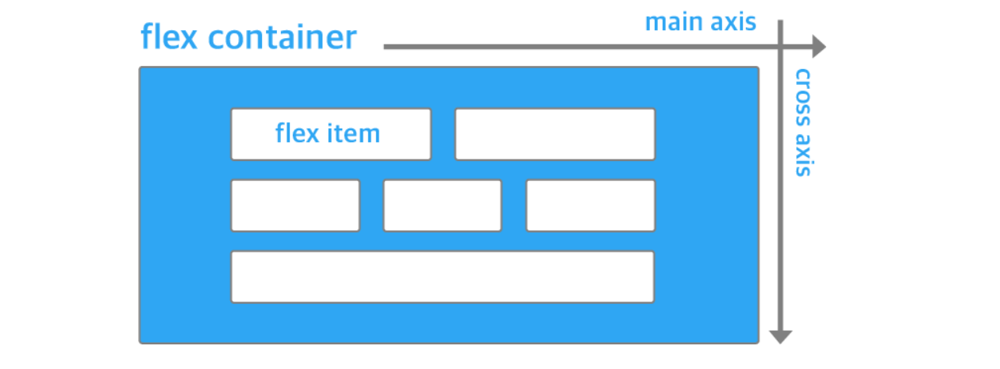
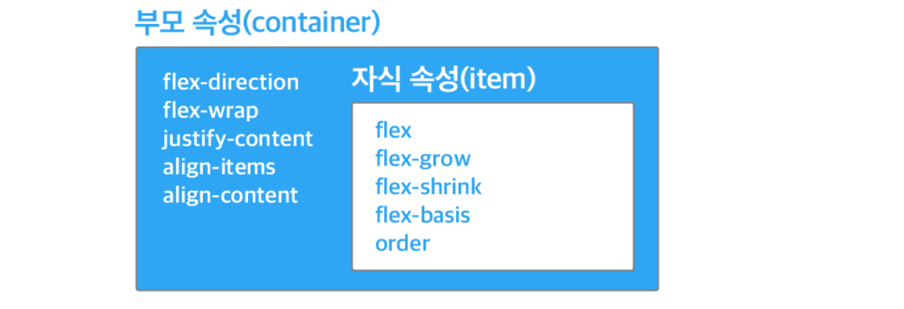
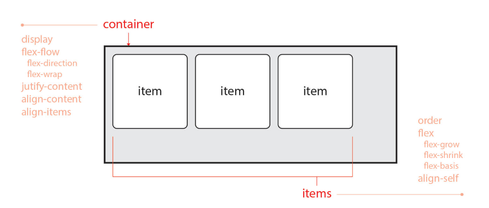
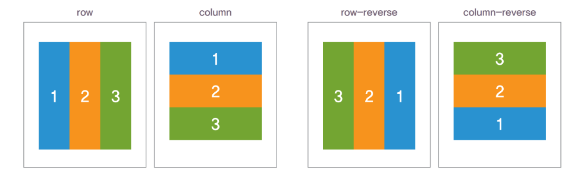
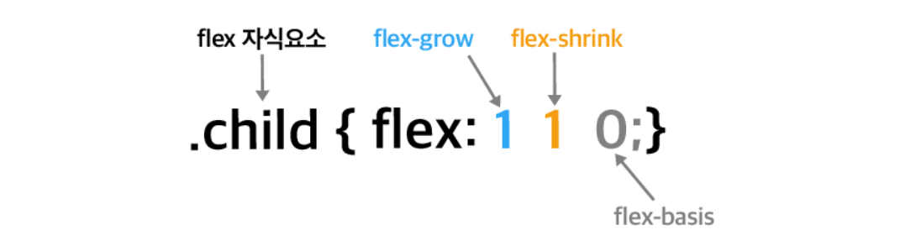
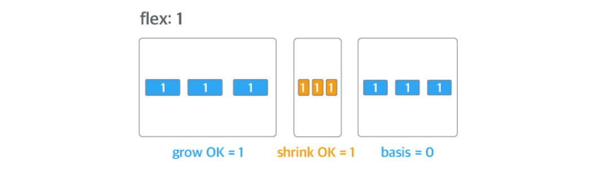
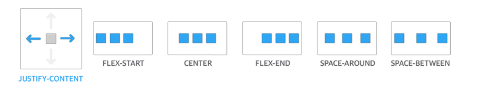
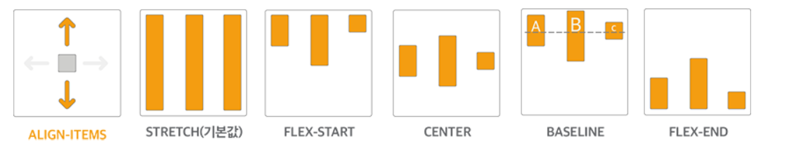
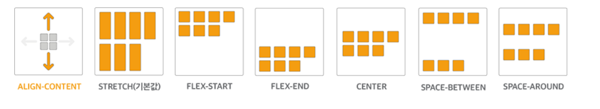

### 🔔 CSS FLEXBOX


#### ✔ [flexbox로 만들 수 있는 10가지 레이아웃](https://d2.naver.com/helloworld/8540176)


**◼ FLEXBOX**

> flexbox는 뷰포트나 요소의 크기가 불명확하거나 동적으로 변할 때에도 효율적으로 요소를 배치, 정렬, 분산할 수 있는 방법을 제공하는 CSS3의 새로운 레이아웃 방식


**◼ FLEXBOX 구성** 

> lexbox는 복수의 자식 요소인 flex item과 그 상위 부모 요소인 flex container로 구성된다.




**◼ 부모 요소와 자식 요소에 정의하는 속성 구분**

* flex container 속성

  * ```CSS
    flex-direction, flex-wrap, justify-content, align-items, align-content
    ```

* flex item 속성

  * ```CSS
    flex, flex-grow, flex-shrink, flex-basis, order
    ```






◼ `flex-direction: column, row` 속성으로 방향 정렬 설정 




◼ `flex : 1` 속성으로 자식 요소의 크기 확장



> `flex-grow` 속성과 `flex-shrink` 속성, `flex-basis` 속성을 축약해서 `flex` 속성으로 표현할 때 `flex: 1` 속성은 `flex: 1 1 0` 속성을 의미한다. 
>
> 즉, `flex-grow` 속성의 값이 '1'이고 `flex-shrink` 속성의 값이 '1'이기 때문에 flex container의 크기에 따라 flex item의 크기도 커지거나 작아진다는 의미다.



> `flex` 속성의 값으로 정수 하나만 선언하면 선언한 값은 `flex-grow` 속성의 값이 된다. 
>
> 나머지는 기본값인 `flex-shrink: 1` 속성과 `flex-basis: 0` 속성이 적용된다. 
>
> `flex` 속성에 한 개의 정숫값만 있으면 이것은 `flex-grow` 속성의 값만 지정하는 단축 속성이다. 
>
> 즉, `flex: 2`는 `flex: 2 1 0`을, `flex: 3`은 `flex: 3 1 0`을 나타낸다. 


---


**◼ `justify-content: space-between` 속성으로 자식 요소를 일정한 간격으로 정렬**

- `flex-start`(기본값): 주축의 시작 부분을 기준으로 flex item을 정렬한다.
- `center`: 주축의 중앙을 기준으로 flex item을 정렬한다.
- `flex-end`: 주축의 끝부분을 기준으로 flex item을 정렬한다.
- `space-around`: 주축을 기준으로 flex item을 일정한 간격으로 정렬한다.
- `space-between`: 첫 번째와 마지막 flex item은 주축의 시작 부분과 끝부분에 정렬하고 나머지 flex item을 일정한 간격으로 정렬한다.




---


**◼ `align-items: center` 속성으로 자식 요소를 교차축의 중앙에 정렬**

- `stretch`(기본값): flex item의 높이를 늘려 flex container의 전체 높이를 채운다.
- `flex-start`: 교차축의 시작 부분을 기준으로 flex item을 정렬한다.
- `center`: 교차축의 중앙을 기준으로 flex item을 정렬한다.
- `baseline`: 글꼴의 기준선인 baseline을 기준으로 flex item을 정렬한다.
- `flex-end`: 교차축의 끝부분을 기준으로 flex item을 정렬한다.



---


**◼ `justify-content: space-around` 속성과 `align-content: space-around` 속성으로 항목을 균등한 간격으로 정렬 **

- `stretch`(기본값): flex item의 높이를 늘려 flex container의 전체 높이를 채운다.
- `flex-start`: 교차축의 시작 부분을 기준으로 정렬한다.
- `center`: 교차축의 중앙을 기준으로 정렬한다.
- `flex-end`: 교차축의 끝부분을 기준으로 정렬한다.
- `space-around`: 교차축을 기준으로 flex-item을 일정한 간격으로 정렬한다.
- `space-between`: 첫 번째와 마지막 flex item은 교차축의 시작 부분과 끝부분에 정렬하고 나머지 flex item을 일정한 간격으로 정렬한다.




---


