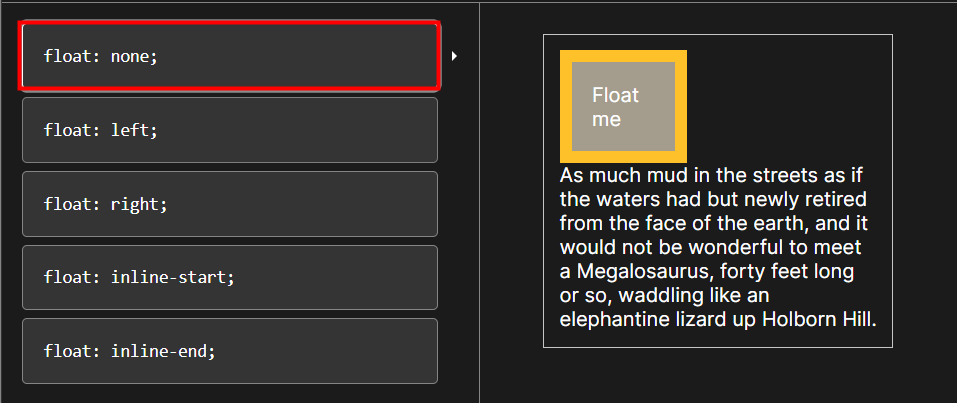
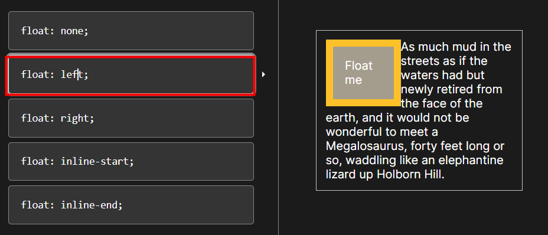
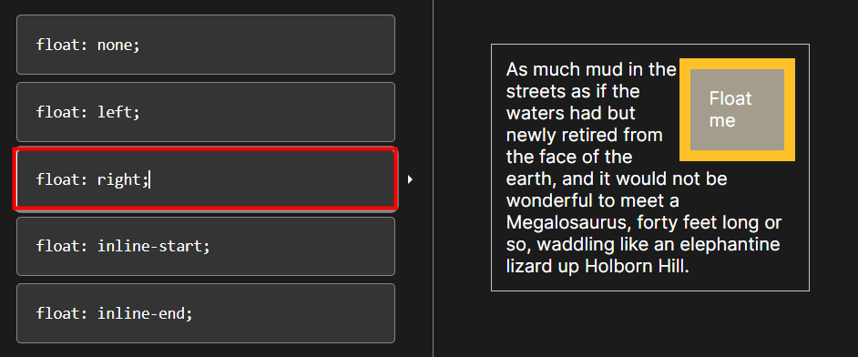
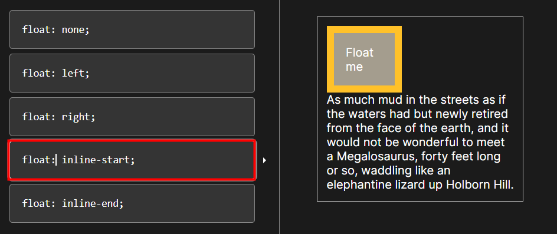
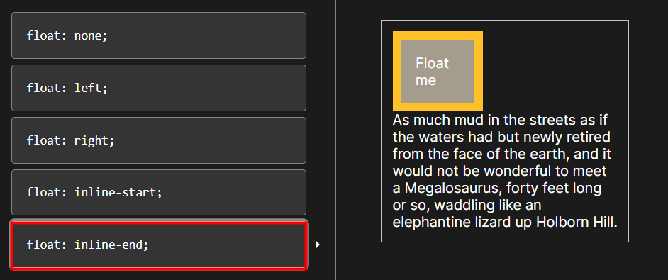

<<<<<<< HEAD
### 🔔 CSS Layout

#### CSS layout techniques

* Display
* Position
* Float (CSS1, 1996)
* Flexbox (2012)
* Grid (2017)

---

#### 1. Float 

* 박스를 왼쪽 혹은 오른쪽으로 이동시켜 텍스트를 포함 인라인요소들이 주변을 wrapping 하도록 함

* 요소가 Normal flow를 벗어나도록 함

**(1) float : none;**

**(2) float : left;**

**(3) float : right;**

**(4) float : inline-start;**

**(5) float : inline-end;**

=======
### 🔔 CSS Layout

#### CSS layout techniques

* Display
* Position
* Float (CSS1, 1996)
* Flexbox (2012)
* Grid (2017)

---

#### 1. Float 

* 박스를 왼쪽 혹은 오른쪽으로 이동시켜 텍스트를 포함 인라인요소들이 주변을 wrapping 하도록 함

* 요소가 Normal flow를 벗어나도록 함

**(1) float : none;**

**(2) float : left;**

**(3) float : right;**

**(4) float : inline-start;**

**(5) float : inline-end;**

>>>>>>> 6e77fadce0748bfea1eac7fc7fbfc56f86a596e1
