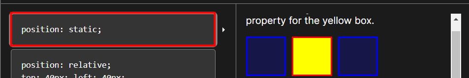
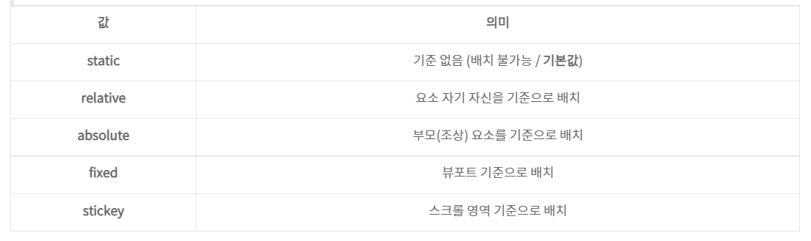
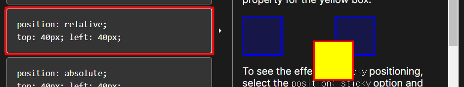
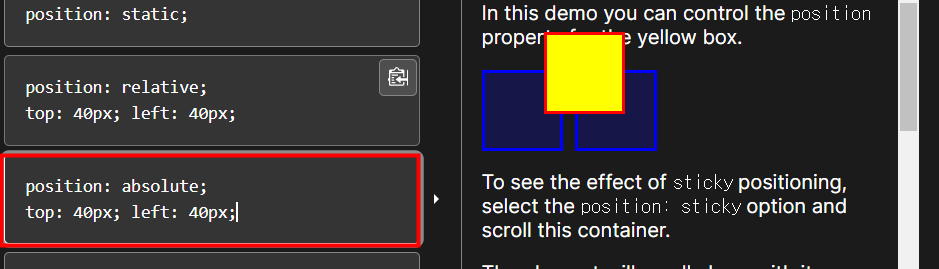
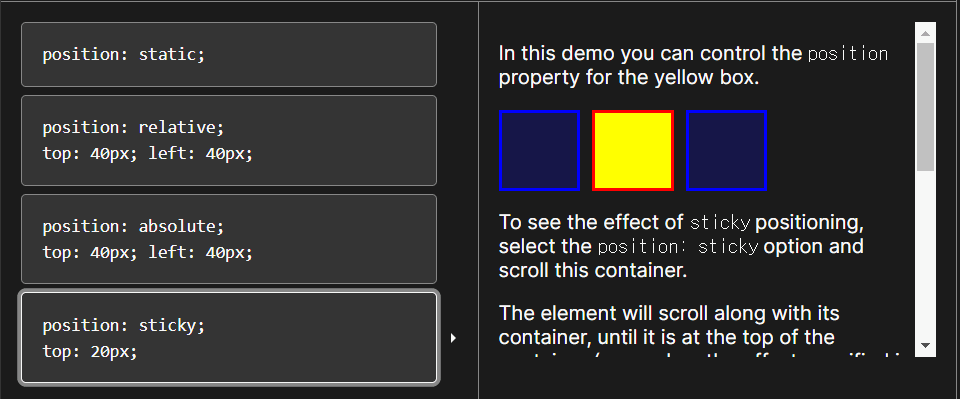

### 🔔 CSS position 

* **문서 상에서 요소의 위치를 지정** 

* **static : 모든 태그의 기본값(기준 위치)**

  

  * 일반적인 요소의 배치 순서에 따름(좌측상단)
  * 부모 요소 내에서 배치도리 때는 부모 요소의 위치를 기준으로 배치 됨 

* **top, bottom, left, right 를 사용하여 이동이 가능** 

  ---

  - top : 요소의 position 기준에 맞는 위쪽에서의 거리(위치)를 설정
  - bottom : 요소의 position 기준에 맞는 아래쪽에서의 거리(위치)를 설정
  - left : 요소의 position 기준에 맞는 왼쪽에서의 거리(위치)를 설정
  - right : 요소의 position 기준에 맞는 오른쪽에서의 거리(위치)를 설정

  ---

  *   **relative**   : 상대 위치 (본인의 원래 위치)
    * 자기 자신의 static 위치를 기준으로 이동 (normal flow 유지)
    * 레이아웃에서 요소가 차지하는 공간은 static일때와 같다. (nomal position 대비 offset)

  

  

  *   **absolute**   : 절대위치 (특정 부모의 위치)
    * 요소를 일반적인 문서 흐름에서 제거 후 레이아웃에 공간을 차지하지 않음 (normal flow에서 벗어남)
    * static이 아닌 가장 가까이 있는 부모/조상 요소를 기준으로 이동 (없는 경우 브라우저 화면 기준으로 이동)

  

  

  *   **fixed**   : 고정 위치 (화면의 위치)

    * 요소를 일반적인 문서 흐름에서 제거 후 레이아웃에 공간을 차지하지 않음 (normal flow에서 벗어남)
    * 부모 요소와 관계없이 viewport를 기준으로 이동 & 스크롤 시에도 항상 같은 곳에 위치함

    

  *   **sticky**   : 스크롤에 따라 static -> fixed로 변경 

    * 속성을 적용한 박스는 평소에 문서 안에서 position: static 상태와 같이 일반적인 흐름에 따르지만
      스크롤 위치가 임계점에 이르면 position: fixed와 같이 박스를 화면에 고정할 수 있는 속성

  

* **absolute vs relative**

> absolute는 normal flow 에서 벗어난다. 즉 다음 블록 요소가 좌측 상단으로 붙음 
>
> relative는 normal flow 유지, 실제 위치는 그대로 사람 눈에만 이동함 

* **position sticky**
  * sticky: 스크롤에 따라 static -> fixed로 변경
  * 속성을 적용한 박스는 평소에 문서 안에서 position: static 상태와 같이 일반적인 흐름에 따르지만, 스크롤 위치가 임계점에 이르면 position: fixed와 같이 박스를 화면에 고정할 수 있는 속성
  * 일반적으로 Navigation Bar에서 사용됨

