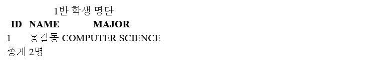
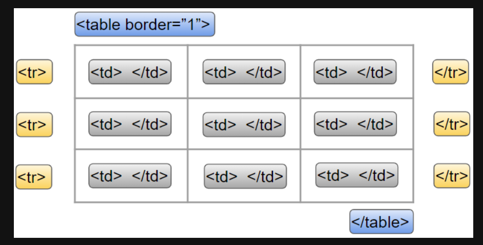
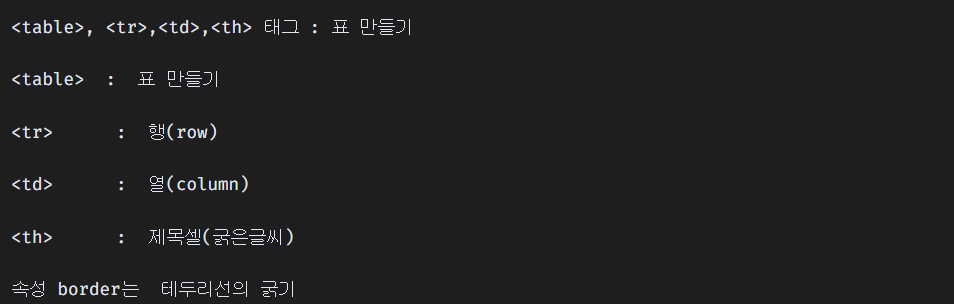
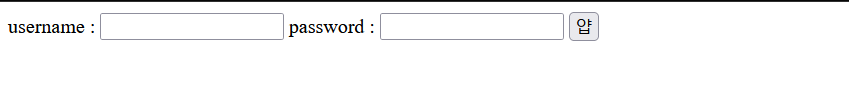
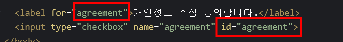
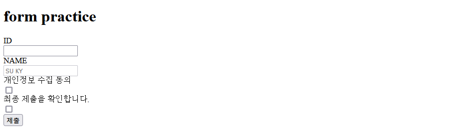

<<<<<<< HEAD
### 💡 HTML 문서 구조화  



```html
<!DOCTYPE html>
<html lang="en">
<head>
  <meta charset="UTF-8">
  <meta http-equiv="X-UA-Compatible" content="IE=edge">
  <meta name="viewport" content="width=device-width, initial-scale=1.0">
  <title>Document</title>
</head>
<body>
  <table>
    <thead>
      <tr>
        <th>ID</th>
        <th>NAME</th>
        <th>MAJOR</th>
      </tr>
    </thead>
    <tbody>
      <tr>
        <td>1</td>
        <td>홍길동</td>
        <td>COMPUTER SCIENCE</td>
      </tr>
    </tbody>
    <tfoot>
      <tr>
        <td>총계</td>
        <td colspan="2">2명</td>
      </tr>
    </tfoot>
    <caption>1반 학생 명단</caption>
  </table>
  
</body>
</html>
```


* **table의 각 영역을 명시하기 위해 <thead> <tbody> <tfoot> 요소를 활용**






---


#### ✔ form 

* **form 은 정보(데이터)를 서버에 제출하기 위해 사용하는 태그** 

* **form 기본 속성**

  (장고에서 중요)

  * **action** : form 을 처리할 서버의 URL _데이터를 보낼 곳

  * **method** : form 을 제출할 때 사용할 HTTP 메서드 (GET 혹은 POST)

  * **enctype** :  method 가 post 인경우 데이터의 유형 

    * application/x-www-form-urlencoded : 기본값
    * multipart/form-data : 파일 전송시 (input type이 file인 경우)
    * text/plain : HTML5 디버깅 용 (잘 사용되지 않음

    

---


#### ✔ input 속성들 

---

◼ **name** : form control에 적용되는 이름 (이름/값 페어로 전송됨)

◼ **value** : form control에 적용되는 값 (이름/값 페어로 전송됨)

◼ **required, readonly, autofocus, autocomplete, disabled 등**

---

* 기본값이 인라인인지 블록인지 잘 살펴보기 

* 디테일 신경쓰기 

* autofocus 작은 코드로 편리함을 줄 수 있다. 

* 위젯 타입을 바꾸면 위젯이 바뀐다. 

* 타입에 대한 종류 살피기 

```html
<body>
  <form action="">
    username : <input type="email" name="unsername">
    password : <input type="password" name="name">
    <input type="submit" value="얍">
  </form>
</body>
```



---


* **input과 함께 활용하는 것 label**
* **value를 지정해야 한다. 그리고 name을 같이 맞춰줘야한다.** 

* **label 을 클릭하여 input 자체의 초점을 맞추거나 활성화 시킬 수 있다.** 



* **input에 id 속성을, label에는 for 속성을 활용하여 상호 연관을 시킴**
* **for와 id 일치시켜서 살피기** 


---

```html
<body>
  <h1>form practice</h1>
  <form action="">
    <div class="input-group">
      <label for="username">ID</label>
    </div>
    <input type="text" name="username" id="username" autofocus>
    
    <div class="input-group">
      <label for="name">NAME</label>
    </div>
    <input type="text" name="name" value="SU KY" id="name" disabled>
    
    <div class="input-group">
      <label for="agreement">개인정보 수집 동의</label>
    </div>
    <input type="checkbox" name="greement" id="agreement">
    <div class="input-group">
      <label>최종 제출을 확인합니다.</label>
    </div>
    <input type="checkbox">
  </form>
  <input type="submit" value="제출">
</body>
```





---


#### ✍ 필기내용

* input 유형 - 항목 중 선택 

* value를 지정해야 한다. 그리고 name을 같이 맞춰줘야한다. 

* form : input으로 입력을 받아서 서버에 전송 즉 사용자 입력값을 변수로 저장해야되기 때문에 name 일치 

* value는? 서버로 어떻게 보낼지 

* radio나 checkbox는 name 일치시키고 value를 꼭 작성해야한다. 
* 다양한 종류의 input을 위한 picher를 제공 (color, date)
* hidden input을 활용하여 사용자 입력을 받지 않고 서버에 전송되어야 하는 값을 설정


---


### 💡 Bootstrap


1) **빠르게 개발을 해본다.** 
2) **기본 마크업 파일들을 어떠한 형식으로 관리하고 있는가** 


* **Bootstrap** 

  * **빠르게 디자인하고 반응형 모바일 / 가장 유명한  / 그리드 / 미리 만들어진 컴포넌트가 있다.** 
  * **html vs bootstrap**
  * **margin top을 날려버림_ 마진상쇄** 
  * **하이라이트 밑줄 색깔 다름**

  

* **spacing 종합**

| **m** | **margin**  |
| ----- | ----------- |
| **p** | **padding** |


|   t   |     **top**     |
| :---: | :-------------: |
| **b** |   **bottom**    |
| **s** |    **left**     |
| **e** |    **right**    |
| **x** | **left, right** |
| **y** | **top, bottom** |


| class name | rem  |  px  |
| :--------: | :--: | :--: |
|    m-1     | 0.25 |  4   |
|    m-2     | 0.5  |  8   |
|    m-3     |  1   |  16  |
|    m-4     | 1.5  |  24  |
|    m-5     |  3   |  48  |


* **mx-auto**
=======
### 💡 HTML 문서 구조화  


```html
<!DOCTYPE html>
<html lang="en">
<head>
  <meta charset="UTF-8">
  <meta http-equiv="X-UA-Compatible" content="IE=edge">
  <meta name="viewport" content="width=device-width, initial-scale=1.0">
  <title>Document</title>
</head>
<body>
  <table>
    <thead>
      <tr>
        <th>ID</th>
        <th>NAME</th>
        <th>MAJOR</th>
      </tr>
    </thead>
    <tbody>
      <tr>
        <td>1</td>
        <td>홍길동</td>
        <td>COMPUTER SCIENCE</td>
      </tr>
    </tbody>
    <tfoot>
      <tr>
        <td>총계</td>
        <td colspan="2">2명</td>
      </tr>
    </tfoot>
    <caption>1반 학생 명단</caption>
  </table>
  
</body>
</html>
```


* **table의 각 영역을 명시하기 위해 <thead> <tbody> <tfoot> 요소를 활용**


---


#### ✔ form 

* **form 은 정보(데이터)를 서버에 제출하기 위해 사용하는 태그** 

* **form 기본 속성**

  (장고에서 중요)

  * **action** : form 을 처리할 서버의 URL _데이터를 보낼 곳

  * **method** : form 을 제출할 때 사용할 HTTP 메서드 (GET 혹은 POST)

  * **enctype** :  method 가 post 인경우 데이터의 유형 

    * application/x-www-form-urlencoded : 기본값
    * multipart/form-data : 파일 전송시 (input type이 file인 경우)
    * text/plain : HTML5 디버깅 용 (잘 사용되지 않음

    

---


#### ✔ input 속성들 

---

◼ **name** : form control에 적용되는 이름 (이름/값 페어로 전송됨)

◼ **value** : form control에 적용되는 값 (이름/값 페어로 전송됨)

◼ **required, readonly, autofocus, autocomplete, disabled 등**

---

* 기본값이 인라인인지 블록인지 잘 살펴보기 

* 디테일 신경쓰기 

* autofocus 작은 코드로 편리함을 줄 수 있다. 

* 위젯 타입을 바꾸면 위젯이 바뀐다. 

* 타입에 대한 종류 살피기 

```html
<body>
  <form action="">
    username : <input type="email" name="unsername">
    password : <input type="password" name="name">
    <input type="submit" value="얍">
  </form>
</body>
```


---


* **input과 함께 활용하는 것 label**
* **value를 지정해야 한다. 그리고 name을 같이 맞춰줘야한다.** 

* **label 을 클릭하여 input 자체의 초점을 맞추거나 활성화 시킬 수 있다.** 


* **input에 id 속성을, label에는 for 속성을 활용하여 상호 연관을 시킴**
* **for와 id 일치시켜서 살피기** 


---

```html
<body>
  <h1>form practice</h1>
  <form action="">
    <div class="input-group">
      <label for="username">ID</label>
    </div>
    <input type="text" name="username" id="username" autofocus>
    
    <div class="input-group">
      <label for="name">NAME</label>
    </div>
    <input type="text" name="name" value="SU KY" id="name" disabled>
    
    <div class="input-group">
      <label for="agreement">개인정보 수집 동의</label>
    </div>
    <input type="checkbox" name="greement" id="agreement">
    <div class="input-group">
      <label>최종 제출을 확인합니다.</label>
    </div>
    <input type="checkbox">
  </form>
  <input type="submit" value="제출">
</body>
```


---


#### ✍ 필기내용

* input 유형 - 항목 중 선택 

* value를 지정해야 한다. 그리고 name을 같이 맞춰줘야한다. 

* form : input으로 입력을 받아서 서버에 전송 즉 사용자 입력값을 변수로 저장해야되기 때문에 name 일치 

* value는? 서버로 어떻게 보낼지 

* radio나 checkbox는 name 일치시키고 value를 꼭 작성해야한다. 
* 다양한 종류의 input을 위한 picher를 제공 (color, date)
* hidden input을 활용하여 사용자 입력을 받지 않고 서버에 전송되어야 하는 값을 설정


---


### 💡 Bootstrap


1) **빠르게 개발을 해본다.** 
2) **기본 마크업 파일들을 어떠한 형식으로 관리하고 있는가** 


* **Bootstrap** 

  * **빠르게 디자인하고 반응형 모바일 / 가장 유명한  / 그리드 / 미리 만들어진 컴포넌트가 있다.** 
  * **html vs bootstrap**
  * **margin top을 날려버림_ 마진상쇄** 
  * **하이라이트 밑줄 색깔 다름**

  

* **spacing 종합**

| **m** | **margin**  |
| ----- | ----------- |
| **p** | **padding** |


|   t   |     **top**     |
| :---: | :-------------: |
| **b** |   **bottom**    |
| **s** |    **left**     |
| **e** |    **right**    |
| **x** | **left, right** |
| **y** | **top, bottom** |


| class name | rem  |  px  |
| :--------: | :--: | :--: |
|    m-1     | 0.25 |  4   |
|    m-2     | 0.5  |  8   |
|    m-3     |  1   |  16  |
|    m-4     | 1.5  |  24  |
|    m-5     |  3   |  48  |


* **mx-auto**
>>>>>>> 6e77fadce0748bfea1eac7fc7fbfc56f86a596e1
  * **블록요소, 수평 중앙 정렬, 가로 가운데 정렬**